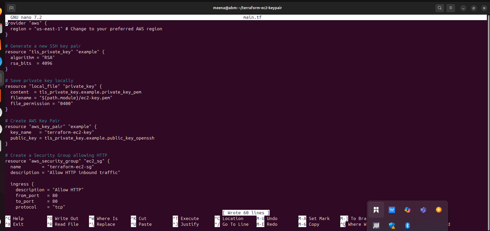
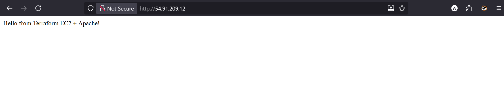

# Terraform-Ec2_Instances_With_Key_Pair_And_Use_Data

# Project Tasks:

## Task 1: Terraform Configuration for EC2 Instance
1. Create a new directory for your Terraform project (e.g., terraform-ec2-keypair).

2. Inside the project directory, create a Terraform configuration file (e.g., main.tf).

3. Write Terraform code to create an EC2 instance with the following specifications:
- image.png
- PNG 42.46KB
- this too

Here is the text extracted from the image:

- Instance type: t2.micro

- Key pair: Generate a new key pair and make it downloadable.

- Security group: Allow incoming traffic on port 80.

4. Initialize the Terraform project using the command: terraform init.

5. Apply the Terraform configuration to create the EC2 instance using the command: terraform apply.

.

## Task 2: User Data Script Execution
1. Extend your Terraform configuration to include the execution of the provided user data script.

2. Modify the user data script to install and configure Apache HTTP server.

3. Apply the updated Terraform configuration to launch the EC2 instance with the user data script using the command: terraform apply.

